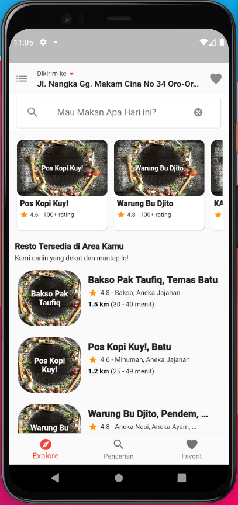
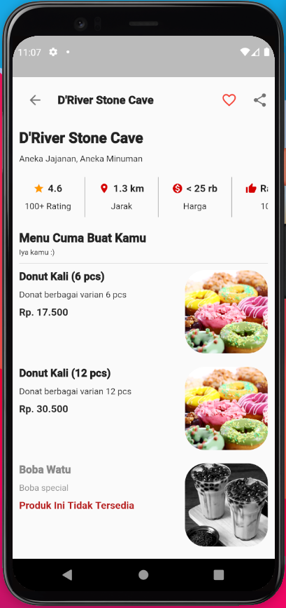
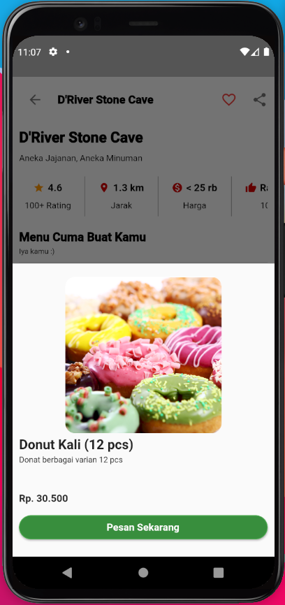

# Gofud Clone

A new Flutter project for dicoding 'Belajar Membuat Aplikasi Flutter untuk Pemula' submission. for this submission I try to clone GoFood Apps by Gojek.

## Getting Started

1. Make Sure your PC has installed well flutter and android SDK, if not, do the following steps:

   - For [Windows](https://flutter.dev/docs/get-started/install/windows)
   - For [MacOS](https://flutter.dev/docs/get-started/install/macos)
   - For [Linux](https://flutter.dev/docs/get-started/install/linux)
   - For [Chrome OS](https://flutter.dev/docs/get-started/install/chromeos)

2. Clone this repository

   ```sh
   git clone https://github.com/kroniz-utab/gofud_clone.git
   cd gofud_clone
   ```

3. Open this project using Visual Studio Code or Android Studio IDE and prepare your device (you can use android emulator on PC or use your android devices)

4. Build flutter by using this command (make sure your PC has connected with android devices)

   ```sh
   flutter run
   ```

5. Wait a moment to flutter build well and installing project to your devices well.

## Screenshoot

### Main Screen

<p align="center">
  &nbsp; &nbsp;
</p>

### Resto Screen

<p align="center">
  &nbsp; &nbsp;
</p>
